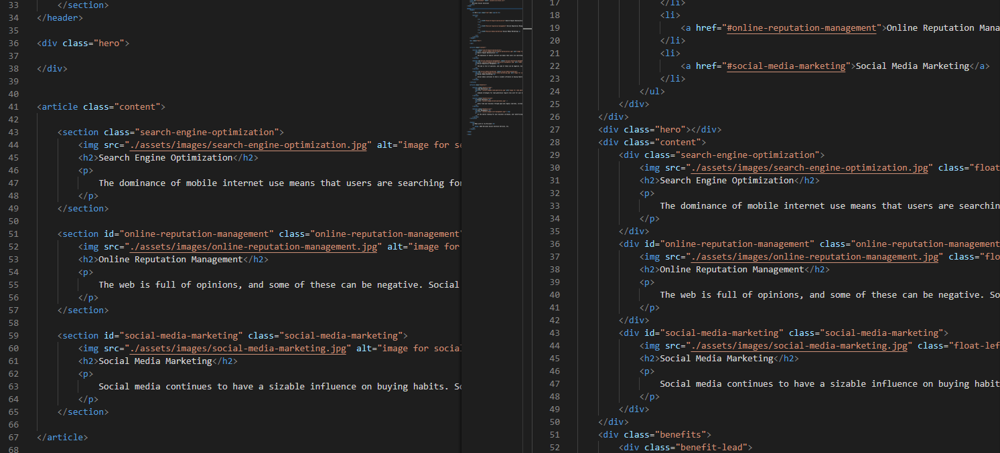

# Horiseon Social Service Solutions Site

## Description
The project given was to rewrite the code of a marketing agency's website to be more semantically accurate, perform a logical restructure of the elements within the site and make it more accessible, by providing accurate alt tags for images within the site.

Below is an example of the changes made, on the left is the refactored code, and on the right is the original, note the use of article and section rather than a collection of divider tags

Additionally, all CSS elements have been commented above with the effect they have on the site's layout and appearance